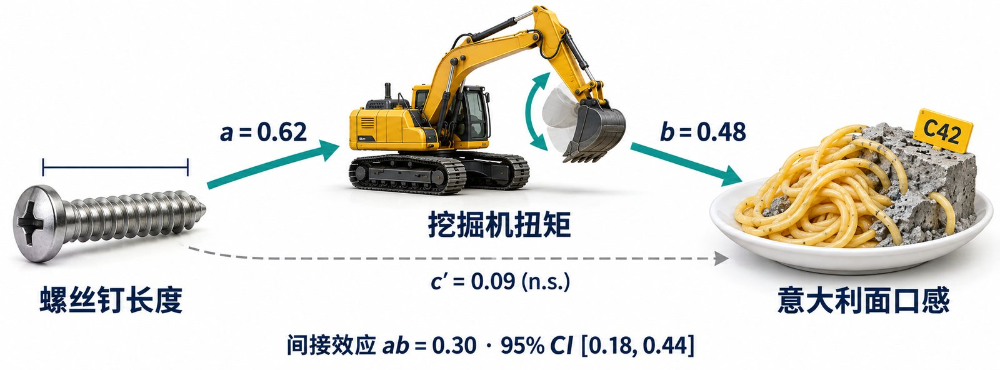
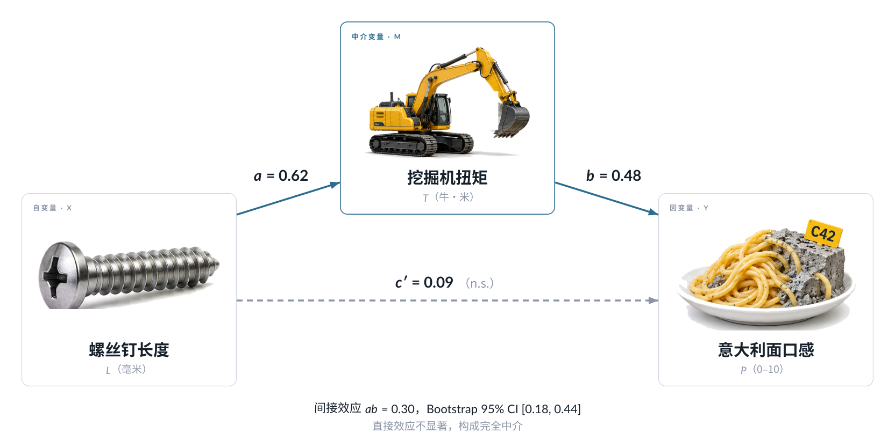

# FigForge

> **JSX → Satori 这条链已单独拆成 [vecfig](https://github.com/zixuzixu/vecfig)**（skill + pasta 案例，名字换成搜得到的）。
> 这里保留全套工作流：ImageGen 探索、matplotlib 数据图、海报、迭代纪律。

**把生成式 AI 的视觉能力和代码的可控性拼起来，做发表级科研插图。**
一个 Claude Code skill，附带从 NeurIPS 投稿里提炼出来的完整方法论和真实案例。

<table>
<tr>
<td width="50%"></td>
<td width="50%"></td>
</tr>
<tr>
<td align="center"><sub>图像模型直出。文字画在像素里，改一个系数要整张重生成</sub></td>
<td align="center"><sub>JSX → Satori → SVG → PDF。矢量、可编辑，换语言改一个字典</sub></td>
</tr>
</table>

## 核心观点

一张能发表的插图不是"让 AI 画一张图"，而是三种能力各司其职：

| 能力 | 负责 | 不负责 |
|---|---|---|
| **ImageGen**（OpenAI / Gemini） | 探索构图方向；产出照片级素材 | 终稿——文字会拼错，布局不可控，非矢量，不可复现 |
| **代码渲染**（JSX→Satori / HTML / matplotlib / TikZ） | 终稿：精确、矢量、可编辑、git 可追踪 | 从零想视觉方向 |
| **迭代纪律** | 2× 渲染、四象限检查、一次改一处、版本号、迭代报告 | — |

两组案例，全在 [`examples/`](examples/)：

- **教学案例**《意大利面就应该拌 42 号混凝土》——数据全部虚构、格式完全严肃。图 1 中介路径图（`pasta-mediation/`）
  和实验流程图（`pasta-workflow/`）都是 JSX → Satori；素材从图像模型生成的原图里抠出来，版面和数字在代码里。
- **真实案例** TRACE 论文的 Figure 1 迭代了 13 轮，OpenAI 3 张 + Gemini 5 张候选全部淘汰，终稿由 Satori 渲染（`trace-figure1/`）。
  散点图的 13 个 label 放弃 `adjustText` 改全手动才做到零交叉（`trace-fig4-scatter/`）。

## 图型 → 工具链

| 图长什么样 | 用什么 | 交付 |
|---|---|---|
| 散点 / 柱状 / 折线，数据驱动 | matplotlib | PDF 300 dpi |
| Teaser / 对比图 / 对话示意 / 流程卡片，有文字流 | JSX → Satori → SVG | `rsvg-convert` → PDF |
| 海报 / 一页纸，要 mm 精度 | HTML + CSS `@page` | Chromium → PDF |
| 数学 / 图结构 | TikZ | 直接 LaTeX |
| 照片级素材、封面底图 | ImageGen → PNG | 嵌入上面任一种 |

完整判定规则：[`skills/figforge/references/decision-tree.md`](skills/figforge/references/decision-tree.md)

## 安装

```bash
git clone https://github.com/zixuzixu/figforge.git ~/codes/figforge
cd ~/codes/figforge && ./install.sh
```

装进 `~/.claude/skills/` 的是 symlink，`git pull` 即更新。两个 skill：

- **`figforge`** — 编排层：选工具链、ImageGen 探索、迭代、交付
- **`satori-figure`** — JSX → Satori 的完整工具链（starter、render 脚本、11 条 gotcha、11 个布局 pattern）

依赖：Node ≥ 18、`rsvg-convert`（`apt install librsvg2-bin`）、[uv](https://docs.astral.sh/uv/)、
Lato 字体（`apt install fonts-lato`）。中文图另需 Noto Sans CJK（`apt install fonts-noto-cjk`），
Satori 不认 `.ttc`，用 `examples/pasta-mediation/extract_fonts.py` 抽成 `.otf`。ImageGen 需要 `OPENAI_API_KEY`（可选）。

## 用法

在 Claude Code 里直接说：

> 帮我做一张论文的 Figure 1，左边是现有方法的问题，右边是我们的方法

skill 会先问图的类型、选工具链、（可选）出 ImageGen 候选看方向，然后用 `starter.jsx` 搭骨架、
渲染、切四象限给你看、迭代、最后 `svg2pdf.sh` 出 PDF。

脚本也能单独用：

```bash
python3 skills/figforge/scripts/imagegen.py prompts.jsonl          # 批量出候选
uv run skills/figforge/scripts/inspect_figure.py fig1.svg          # 2× + 四象限
skills/figforge/scripts/svg2pdf.sh fig1.svg figures/fig1.pdf       # 转 PDF + 校验内嵌图
```

## 仓库结构

```
skills/
├── figforge/
│   ├── SKILL.md                      编排层入口
│   ├── references/
│   │   ├── decision-tree.md          图型 → 工具链
│   │   ├── imagegen.md               结构化 prompt 模板；为什么不能当终稿
│   │   ├── iteration-loop.md         五条纪律 + 每轮检查清单
│   │   ├── matplotlib-pub.md         数据图规范；手动 label 放置
│   │   ├── html-print.md             海报：@page、mm、token、导出
│   │   └── pitfalls.md               所有踩过的坑
│   ├── scripts/                      imagegen.py · inspect_figure.py · svg2pdf.sh
│   └── assets/prompts.example.jsonl
└── satori-figure/                    JSX → Satori 工具链（独立可用）
examples/
├── pasta-mediation/                  中介路径图：生图抠素材 + JSX 拼版，中英文一份代码；CJK 字体、箭头注入
├── pasta-workflow/                   实验流程图两版：纯矢量 / 生图图标 atlas 裁切嵌入（并行分支产物）
├── trace-figure1/                    13 轮迭代的全部材料：候选图、终稿、JSX、prompt、迭代报告
└── trace-fig4-scatter/               零交叉散点图：脚本 + 三次 commit 的演进
```

## 致谢

- [Satori](https://github.com/vercel/satori) — 让 JSX 直接变成 SVG
- 教学案例的梗出自博主 @延边刺客（"意大利面就应该拌 42 号混凝土"）；论文数据全部虚构，混凝土不可食用
- 真实案例来自 *TRACE: Tourism Recommendation with Accountable Citation Evidence*（arXiv 预印本）

## License

MIT
