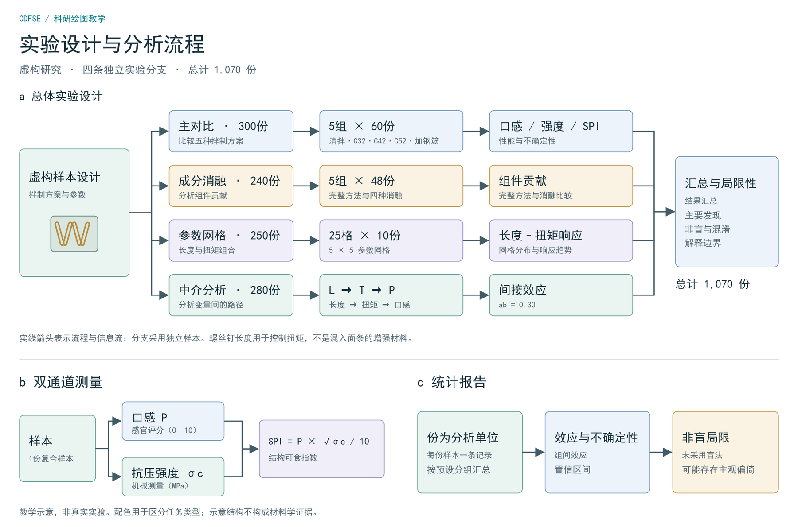
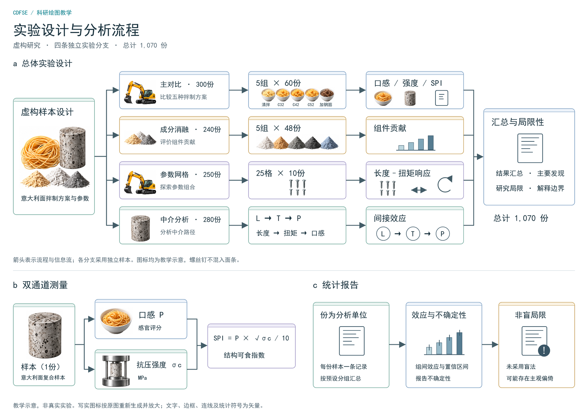

# 案例：同一篇论文的实验流程图，两版 Satori

《意大利面就应该拌 42 号混凝土》的实验设计图（三面板 a/b/c，四条实验分支，1,070 份样本）。
这不是我在这个仓库里做的——是另一条并行分支的产物：把 `satori-figure` skill 装进 Codex 桌面端，
在 Windows 上照着图像模型生成的那张 `design-flow.png` 重建。两版都保留在这里，因为它们各回答一个问题。

| 文件 | 是什么 | 回答的问题 |
|---|---|---|
| `workflow.jsx` + `render-workflow.mjs` → `workflow.png` | **纯矢量版**：卡片、箭头、文字全是 div 和 path | 一张 30 多个节点的流程图，JSX 写起来有多长（5 KB） |
| `workflow-icons.jsx` + `render-workflow-icons.mjs` → `workflow-icons.png` | **混合版**：布局矢量，写实图标从 `workflow-icon-atlas.png` 按区域裁出来嵌入 | 生图素材怎么进矢量版面而不丢掉可编辑性 |

 

## 值得抄的两点

**几何常量导出给箭头脚本共享。** `workflow.jsx` 里 `export const geometry = { laneYs: [230, 344, 458, 572], laneHeight: 88 }`，
渲染脚本 `import` 同一份常量来画四条泳道的箭头。卡片挪 10 px，箭头跟着挪，不用改两处。
`pasta-mediation/` 里的 `LAYOUT` 是同一个思路。

**图标 atlas 按区域裁切。** 九个写实图标先由图像模型生成成一张九宫格 `workflow-icon-atlas.png`，
JSX 里用 `overflow: hidden` 的容器 + 负偏移的 `` 裁出需要的那格（见 `Icon` 组件）。
一张 PNG、一次 base64，九处复用。

## 重建

```bash
npm install                      # satori esbuild @resvg/resvg-js pdfkit svg-to-pdfkit
FIGURE_FONT=/path/to/NotoSansCJKsc-Regular.otf node render-workflow.mjs         # → workflow.svg / .pdf / .png
FIGURE_FONT=/path/to/NotoSansCJKsc-Regular.otf node render-workflow-icons.mjs   # → workflow-icons.*
```

脚本默认字体是 Windows 的 `C:/Windows/Fonts/simhei.ttf`；Linux/macOS 用 `FIGURE_FONT` 指一个支持中文的**单个** TTF/OTF
（`.ttc` 不行，用 `../pasta-mediation/extract_fonts.py` 从 Noto CJK 里抽）。
PDF 走的是 svg-to-pdfkit 而不是 rsvg-convert——因为那台机器没有 rsvg。有 rsvg 的话 `rsvg-convert -f pdf workflow.svg -o workflow.pdf` 更省事。

## 边界

全部数据为虚构，混凝土不可食用。`workflow-icons-prompts.txt` 是生成图标 atlas 用的 prompt，
图标是"按原图重新生成"，不是逐像素复原。
